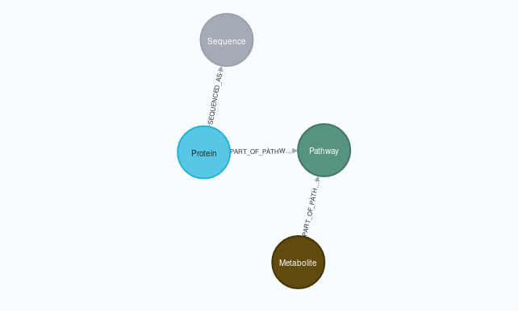

<!--
SPDX-FileCopyrightText: 2022 Pablo Marcos <software@loreak.org>

SPDX-License-Identifier: MIT
-->

# graphify-smpdb

  

 

This script, created as part of my Master's Intenship at IARC, transitions the [Small Molecule Pathway Database](http://smpdb.ca/) (a high quality database containing associations betweem metabolites, proteins and metabolomic pathways) to Neo4J format in an automated way, providing an export in GraphML format.

To run, it uses `alive_progress` to generate an interactive progress bar (that shows the script is still running through its most time-consuming parts) and the `neo4j` python driver. This requirements can be installed using: `pip install -r requirements.txt`.

To run the script itself, use:

`python3 main.py neo4jadress databasename databasepassword`

where:

* **neo4jadress**: is the URL of the database, in neo4j:// or bolt:// format
* **databasename**: the name of the database in use. If using the free version, there will only be one database per project (neo4j being the default name); if using the pro version, you can specify an alternate name here
* **databasepassword**: the passowrd for the **databasename** DataBase. Since the arguments are passed by BaSH onto python3, you might need to escape special characters

NOTE: The files will be downloaded to ./csvfolder, so please run the script somewhere you have read/write permissions

An archived version of this repository that takes into account the gitignored files can be created using: `git archive HEAD -o ${PWD##*/}.zip`

## Important Notices

* Since the "Structure" files at smpdb.ca seemed to be super complicated to import, we decided against doing so. However, regarding the future, they shouldn't be overlooked, as they might include useful info
* The "PW ID" column from the "Pathways" table, and the "Pathway Subject" from the "Metabolite" tables may correlate (both start with PW). However, they seem to use different formats, so we have decided against including them in the Final Database
