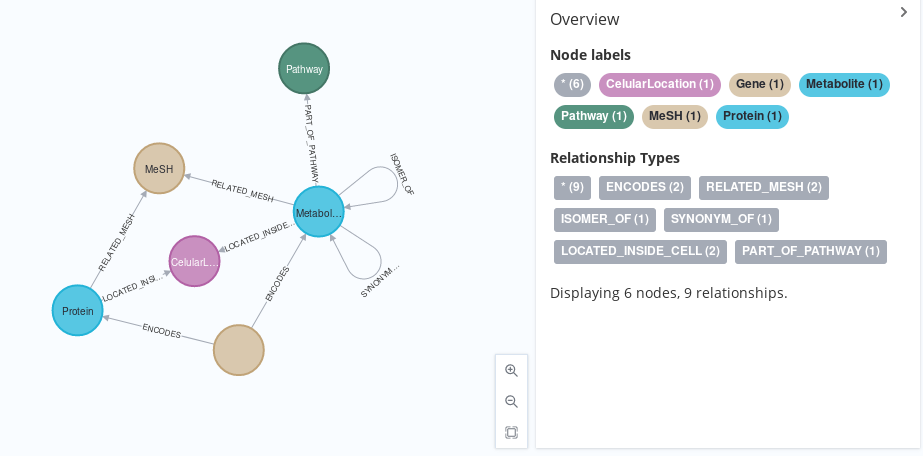

<!--
SPDX-FileCopyrightText: 2022 Pablo Marcos <software@loreak.org>

SPDX-License-Identifier: MIT
-->

# MeSHandMetaNetX

<div align="center">  </div>
<br>

This script, created as part of my Master's Intenship at IARC, transitions the [MetaNetX DataBase](https://www.metanetx.org/) (a high quality database that reconciles nomenclature for metabolites, proteins and metabolomic pathways) to Neo4J format in an automated way, providing an export in GraphML format.

To run, it uses `alive_progress` to generate an interactive progress bar (that shows the script is still running through its most time-consuming parts) and the `neo4j` python driver. This requirements can be installed using: `pip install -r requirements.txt`.

To run the script itself, use:

`python3 main.py neo4jadress databasename databasepassword tsvfolder`

where:

* **neo4jadress**: is the URL of the database, in neo4j:// or bolt:// format
* **databasename**: the name of the database in use. If using the free version, there will only be one database per project (neo4j being the default name); if using the pro version, you can specify an alternate name here
* **databasepassword**: the passowrd for the **databasename** DataBase. Since the arguments are passed by BaSH onto python3, you might need to escape special characters
* **tsvfolder**: The folder where the TSV files for the MetaNetX DataBase are to be downloaded. This will be done automatically by the script.t

NOTE: Since the files will be downloaded to ```csvfolder```, please select somewhere you have read/write permissions

An archived version of this repository that takes into account the gitignored files can be created using: `git archive HEAD -o ${PWD##*/}.zip`

## Important Notices

* Part of the content is taken from TSVs downloaded from [MetaNetX's download page](https://www.metanetx.org/mnxdoc/mnxref.html), and some of the data is acessed through its [SPARQL service](https://rdf.metanetx.org/). This, perhaps surprising, design choice, was taken due to three things: first, MetaNetX does not provide peptXref files, so these necessarily *must come* from the RDF service, if we want to replicate the whole database; second, not all data could be taken from SPARQL due to potential timeouts, so at least some of the data *must come* from the TSVs; and, third, some of the functions where already built for the general script, so it made sense to reuse them here :p
