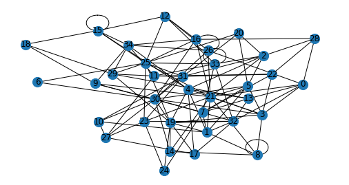

<!--
SPDX-FileCopyrightText: 2022 Pablo Marcos <software@loreak.org>

SPDX-License-Identifier: GPL-3.0-or-later
-->

# transition-databases

<div align="center">  </div>
<br>

This Git Project, created as part of my Master's Intenship at IARC, contains a series of scripts that help transition a series of **five** databases from their native format (XML, CSV, etc) into a common, GraphML format, using a shared schema that has been defined to minimize the number of repeated nodes and properties. This databases are:

* Exposome-Explorer: A hand-curated, high-quality database of associations between metabolites, food intakes and outakes and different diseases, specially cancers.
* Human Metabolome DataBase: An detailed, electronic database containing detailed information about small molecule metabolites found in the human body.
* DrugBank: A unique bioinformatics and cheminformatics resource that combines detailed drug data with comprehensive drug target information.
* Small Molecule Pathway Database: An interactive database containing more than 618 small molecule pathways found in humans, More than 70% of which are unique to this DB
* WikiData: The world's largest collaboratively generated collection of Open Data worldwide.

Each of then have their unique advantages and disadvantages (size, quality, etc) but they have been chosen to work together and help in identifying metabolites and their potential cancer associations at IARC.

With regards to the schema, it can be consulted in detail in the ```new-schema.graphml``` file, which can itself be opened in Neo4J by using: ```CALL apoc.import.graphml("new-schema.graphml", {useTypes:true, storeNodeIds:false, readLabels:True})``` after placing it in your Neo4J's import directory (you can find it in the settings shown after starting the server with ```sudo neo4j start```). It consists of a simplification of all the nodes present on the ```old-schema.graphml``` file (which itself represents the five different schemas that our five databases naturally presented), arrived at by merging nodes and changing relationship names so that they are unique (and, thus, more actionable). One property, ```LabelName``` has been added as a dummy name to generate the image you can see in the header.

This repo only intends to collect information on how to generate ("graphify") each of the five different databases: a further project will automate sub-network generation for metabolite annotation and discovery (stay tuned [to my blog](https://www.pablomarcos.me/es/posts/) :p). More information on how to generate the different graphs can be found on the README for each of the different subfolders for this project.
