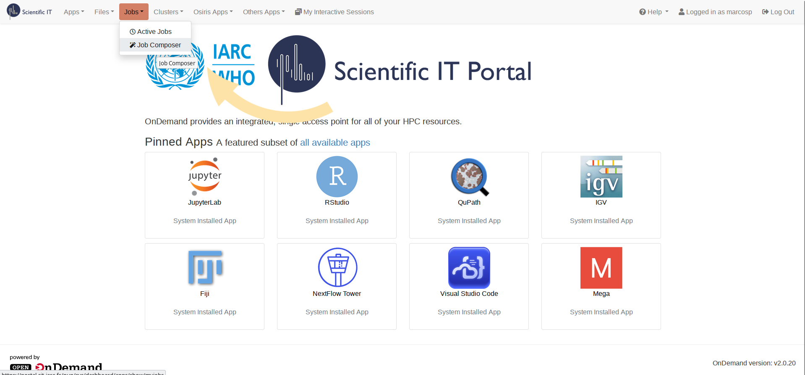
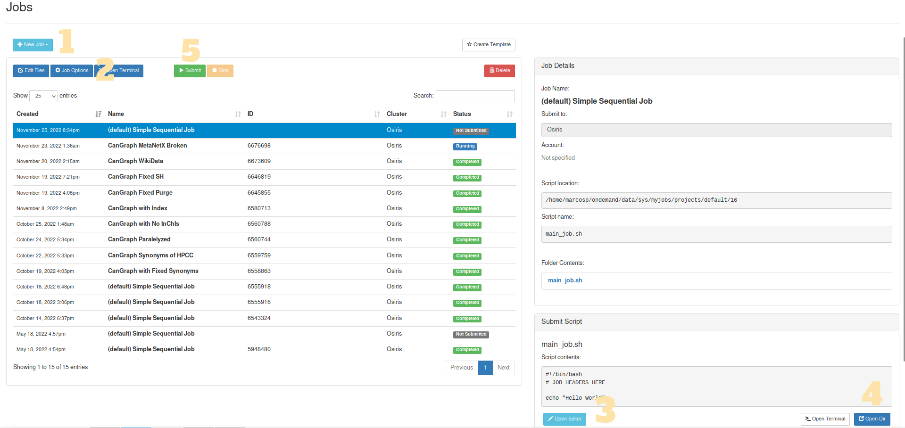
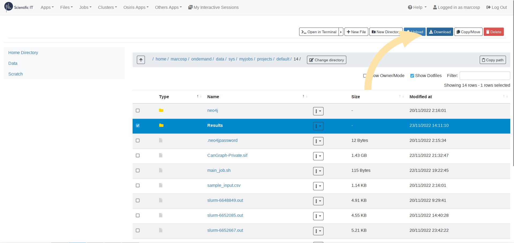

<!--
SPDX-FileCopyrightText: 2022 Pablo Marcos <software@loreak.org>

SPDX-License-Identifier: MIT
-->

# Running the Software

There are two supported ways of running the CanGraph package: you can either launch the CanGraph script from the **command line software** or you can use a pre-packaged **apptainer image**. Of these, there are two versions: a Private Image, which is built with the DataBases pre-bundled so that is is easier to use, although a bit more heavy to transmit; and a Public one, in which DataBases need to be manually set up at least at first use and is thus less heavy, but more resource intensive. Because the Private version contains copyrighted information, only the Public compiled file is provided in the {ref}`downloads page <Downloads>`

You can thus either download a {ref}`pre-packaged file <Downloads>`, compile one yourself or use the program's {ref}`Command Line Interface <Running the Software>`; since all three options use the same underlying script ({obj}`CanGraph.main`) to work, they will all work independently of the form you choose to run the program under.

In the rest of this example, we will be providing examples on how to run the software from the command line; if you want to use an Apptainer Image instead, just replace ``python3 main.py`` by ``./yourcontainer.sif``

## Setting up the environment

````{eval-rst}
.. note:: If you are running a pre-packaged file, you can skip directly to the  :ref:`usage section <Understanding the arguments>`.
````

In order for the script to work properly, we need to set up some things first; the most important of them being **the DataBases folder**, which is where all important information regarding all databases will be stored. To aid in this, the {obj}`CanGraph.setup` was developed; you can read more about how it works and how to use it in its own {ref}`usage page <CanGraph.main Usage>`, but, essentially, you should run:

* ``python3 setup.py -i --databases databasefolder``

where ``databasefolder`` is the folder where all databases will be stored (keep this value in hand because we will use it later on for the {obj}`~CanGraph.main` module).

The software will then guide you, in an interactive an easy to understand way, through the process of setting up all the needed databases, as well as on the generation of an index that might be needed later on in the database search. Once the process is finished, you shall proceed to the next step.

## Starting the Neo4J server

````{eval-rst}
.. note:: If you are running a pre-packaged file, you can skip directly to the  :ref:`usage section <Understanding the arguments>`.
````

As a graph-oriented software, CanGraph uses Neo4J as its underlying DataBase Management System. This means that, in order for the program to work, it needs to stablish a connection to a Neo4J database, where it will store all the relevant information. To simplify the process of downloading, configuring, and starting the Neo4J server, some functions have been created for you on the {obj}`~CanGraph.setup` module. You can call them using the script below, which will create a neo4j folder in CanGraph's WorkDir:

* ``python3 setup.py --neo4j neo4j --neo4j_username neo4j --neo4j_password neo4j ``

For it to work propperly, please ensure that there are no neo4j sessions running before the command call. The program will then be installed alongside the main program, with its password being stored in a file called ``.neo4jpassword``. You can then start your very first neo4j server by running: ``./neo4j/bin/neo4j start``; its username will be ``ǹeo4j``, and its password can be seen by running: ``head -n 1 .neo4jpassword)``.

You can alternatively start your own server, either by using a previously installed version of neo4j or by running an online version of the database; the only difference being, that you will need to provide the username, bolt adress and password to main.py as arguments.

## Understanding the arguments

The program presents the following arguments, which can be passed, as the text below explains, just after the name of the program:

```{eval-rst}
.. argparse::
   :module: CanGraph.main
   :func: args_parser
   :prog: python3 main.py
   :nodefaultconst:
   :nodescription:
```

### The Query File

Of these arguments, only ``--query`` is required, since the program requires for at least one query to search among all the different databases. This query file should take the form of a table of Comma Separated Values, where the columns are as follows:

| Name | InChI | HMDB_ID | ChEBI_ID | MeSH_ID |
|------|-------|---------|-------|------|

Inside each **comma-separated column**, you can either have one string of text (one *field*) or a series of *fields* **separated by semi-colons**. For example, you can either have:
```
Name,InChI,HMDB_ID,ChEBI,MeSH_ID
1-Amino-2-propanol,,HMDB0012136,CHEBI:19030,
```
where there is just one **Name**, **1-Amino-2-propanol**, in the name column; or:
```
Name,InChI,HMDB_ID,ChEBI,MeSH_ID
1-Amino-2-propanol;1-aminopropanol,,HMDB0012136,CHEBI:19030,
```
where **1-Amino-2-propanol** is specified as a synonym / another query of interest for the **Name** field.

This query file can be either created in [LibreOffice Calc](https://www.libreoffice.org/) / Microsoft Excel, simply generating a new file with *as many of the proposed columns as you'd like*, and filling them with the values you want the program to search based on. Any other columns present in the CSV file will be ignored by the program, which will identify each row as the information pertaining to *a given metabolite*, thus having **as many metabolites as rows are present on the CSV, with each metabolite having as many identifiers as columns are present and as many synonyms for each identifier as semicolon values are in a given cell**.

```{eval-rst}
.. note:: Pay special attention to the formatting of the columns; if they are wrongly specified (for example, *ChEBI* instead of *ChEBI_ID*), the program will ignore them, too.
```

### Other Aguments of Interest

Some other arguments that require consideration are:

* **--webdbs**: When set to false (``--webdbs False``), no web databases are queried. This makes the program run fully offline, gets more reliable results and runs faster, but it returns less information.

* **--similarity**: Disables search based on similarity criteria computed using RDKit. This reduces search time, but includes less results

* **--noindex**: Runs the program by using direct search, instead of using the database index generated with the {obj}`~CanGraph.setup` module. **The use of this option is discouraged**, as it is slower and produces less accurate results; it is presented here just for backwards compatibility and because the "Name" chain can be used as a *wildcard* field for exact text matches in the unindexed files.

Once you have the query ready, you can run it using: ``python3 main.py --query inputfile.csv --password $(head -n 1 .neo4jpassword)``. This assumes that all the defaults are set to what is specified above in this same section, and sets neo4j's password to be whatever is stored in ``.neo4jpassword``; you can add any additional arguments as you wish.

The time the program takes to process is variable, and depends on the number of matches; it may take anything from a few seconds to more than a day, as every match means, approximately, 3-5 minutes of extra processing time.

## Running on Slurn

For IARC users, as well as for any other user with access to it, the use of a High-Performance Computing platform is advised, since Neo4J is quite unstable and resource-hungry, and the program may take a long time to process during which, if using it in your own machine, it is advisable not to run any other programs at the same time. Thus, a tutorial follows:

0. **Log into [IARC's HPC Portal](https://portal.sit.iarc.fr/pun/sys/dashboard).** There, click on *Jobs* > *Job Composer* in the top menu



1. **Create a new Job.** To do this, click on the light blue *New Job* button, and then select one of the option; it is recommended that you choose *From Default Template*
2. **(Optional) Change the Job's name.** You can do so by selecting any job and clicking *Job Options*
3. **Modify the Runscript.** After clicking on the *Open Editor* button, an editor will appear in a new window. You should modify ``main_job.sh`` for it to include an order calling the script preceded by another giving the HPC permission to use it (``chmod``). For example, if you are using the pre-packaged CanGraph-Private image:
    ```
    chmod +755 CanGraph-Private.sif
    ./CanGraph-Private.sif  --query sample_input.csv
    ```
    If you are, however, using the Command Line Interface, you may want to also include the ``--databases``parameter, and so on
4. **Add all the necessary files:** Click on *Open Dir*, which will open a new window containing all the files in the current WorkDir. There, you should Drag and Drop the necessary files: the ``DataBases`` folder in case you are using it, the different scripts and modules that form the Command Line Program (possibly in compressed ``.zip`` form), the apptainer image, the input file...
5. **Once everything is ready, run the file!:** You can click on the green *Submit* button, which will mark your Job in blue as *Running*. While the HPC is working on your query, a new file, called *slurm-xxxxxxx.out*, will appear on the side *Folder Contents* panel, which can also be consulted using the *Open Dir* button. This file contains an output of the different logs the program is providing, enabling you to track the process and see how it is going. Once processing is finished, a green *Completed*, or a red *Failed*, label will appear. The results will appear in the folder provided to the program as ``--results``; by default, ``./Results``.

```{eval-rst}
.. note:: Sometimes, the software might not run in one-go, but might need two activations: one to install neo4j, and one for the run itself. Out of precaution, it is recommended you refresh 1 minute after submitting the job to see if it is prematurely marked as completed (with no results in the folder). If so, just re-submit the job: things should work fine this time.
```



6. **Download the Results:** You will find them inside the ``--results`` folder, and you can either download the full folder (*Select* > *Download*) or get individual files by selecting them inside the folder.


