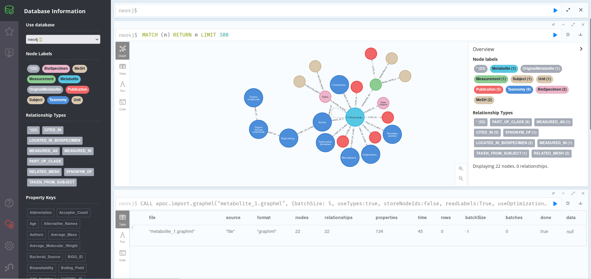
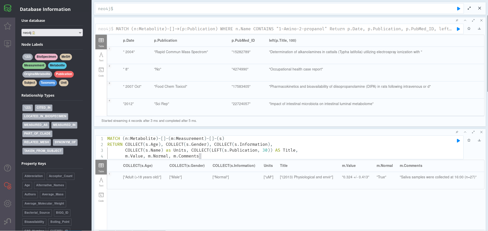
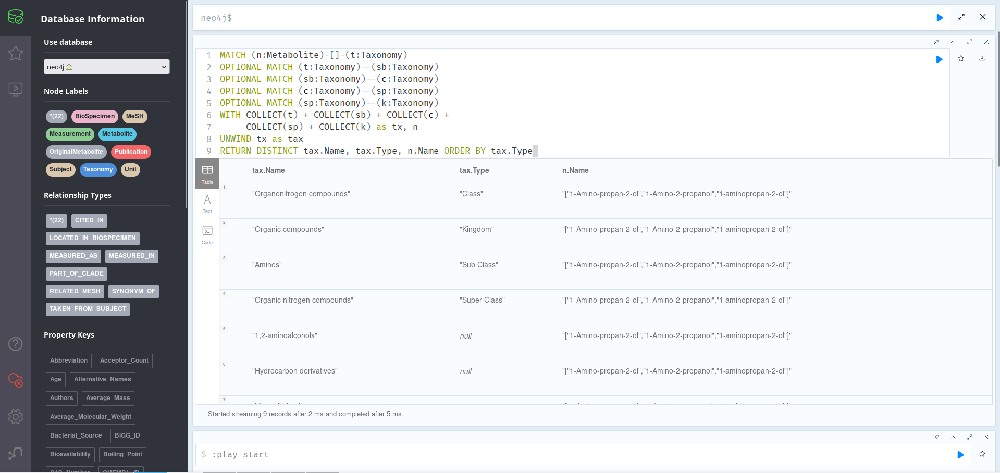
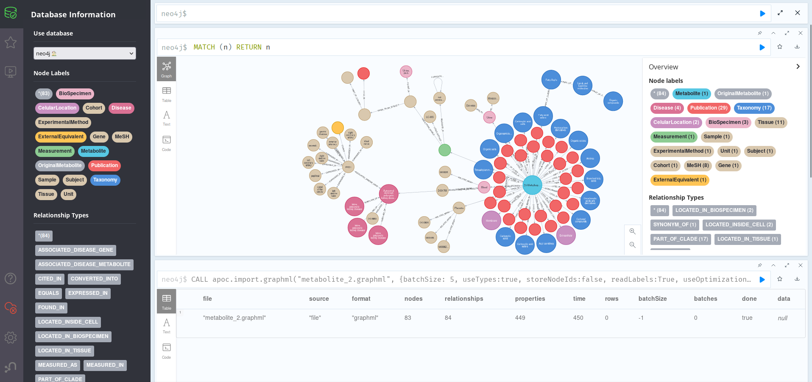
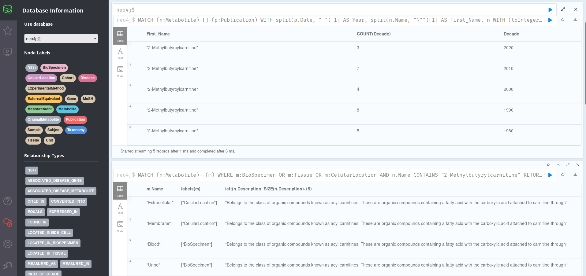
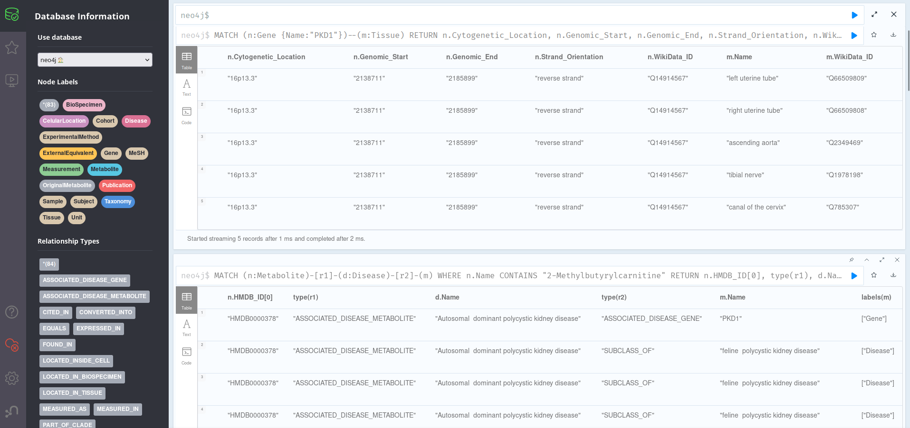
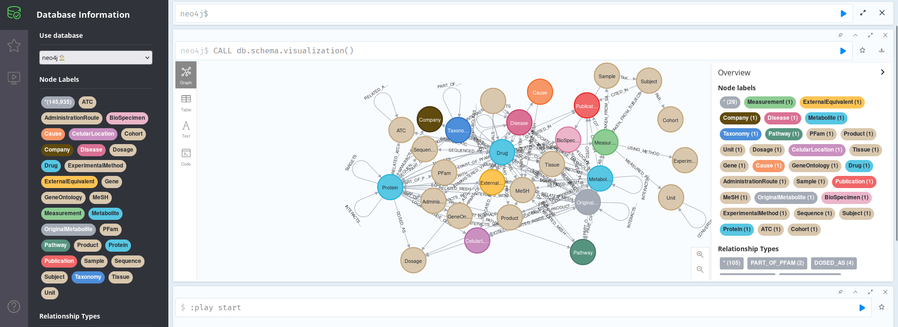
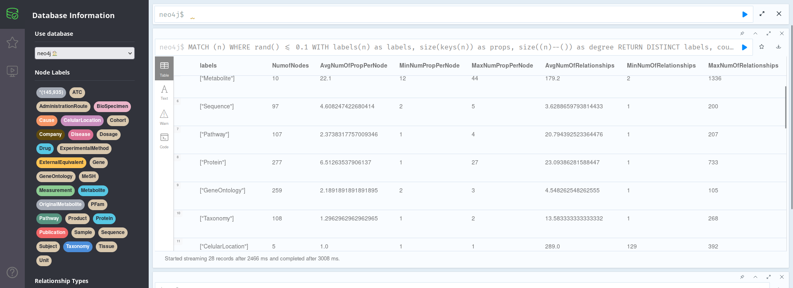
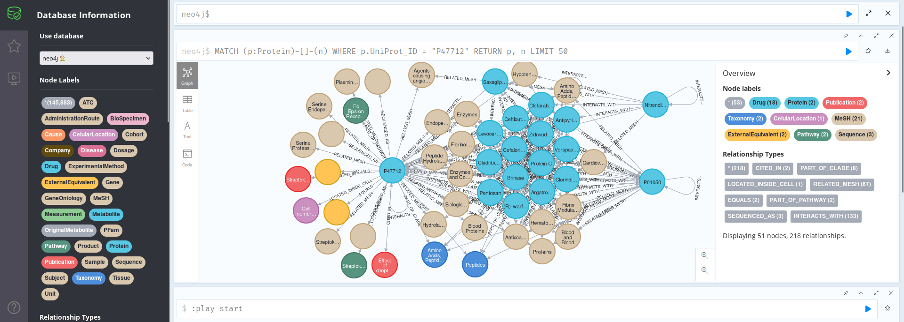
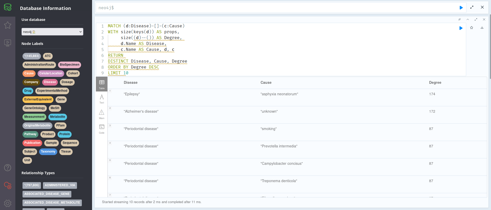

<!--
SPDX-FileCopyrightText: 2022 Pablo Marcos <software@loreak.org>

SPDX-License-Identifier: MIT
-->

# Understanding its Outputs

For now, the CanGraph software itself is not capable of analyzing the generated networks and providing answers to your questions. To remedy this as much as possible, this part of the tutorial is centered with giving meaningful examples of possible outputs of the program, making its results more understandable.

For this, we are using a sample CSV file (which you can get in [the link below](./_static/Tutorials/sample_input.csv)), [the Results](./_static/Tutorials/metabolite_1.graphml) that [you obtain](./_static/Tutorials/metabolite_2.graphml) when you compute that CSV file and the [Neo4J browser](https://neo4j.com/product/developer-tools/#browser). If you have, until now, only followed the steps of the tutorial regarding the installation and usage of the Apptainer image, you might not have neo4j installed in your system. The easiest way to solve this is to install it using {ref}` the python modules in CanGraph itself <CanGraph.setup module>`. You can run the following set of commands on a Linux System:

```bash
sudo apt update # Update the software lisy to last version
# Install required software for python to run
sudo apt install python3.9 python3-pip default-jdk default-jre git
apt -y autoremove; apt -y clean # Clean the package manager
git clone https://github.com/OMB-IARC/CanGraph # Clone the project
cd CanGraph # CD into the directory
python3 -m pip --no-cache-dir install --upgrade pip # Upgrade PIP
python3 -m pip install -r requirements.txt # Install python modules
python3 setup.py --neo4j neo4j # And run it!
```

::::{grid}
:gutter: 2 3 3 3
:margin: 4 4 1 2

:::{grid-item}
:columns: 12 8 8 8
:child-align: justify

[You can download the CSV file used for this examples here](./_static/Tutorials/sample_input.csv)

:::

:::{grid-item}
:columns: 12 4 4 4

```{image} ./_static/Tutorials/Calc-Logo.png
:width: 50px
:target: ./_static/Tutorials/sample_input.csv
:class: sd-m-auto sd-animate-grow50-rot20
```
:::

:::{grid-item}
:columns: 12 2 2 2

```{image} ./_static/Tutorials/Fediverse-Logo.png
:width: 50px
:target: ./_static/Tutorials/metabolite_1.graphml
:class: sd-m-auto sd-animate-grow50-rot20
```
:::

:::{grid-item}
:columns: 12 2 2 2

```{image} ./_static/Tutorials/Fediverse-Logo.png
:width: 50px
:target: ./_static/Tutorials/metabolite_2.graphml
:class: sd-m-auto sd-animate-grow50-rot20
```
:::

:::{grid-item}
:columns: 12 8 8 8
:child-align: justify

And here, you can get the results for [Metabolite 1](./_static/Tutorials/metabolite_1.graphml) and [Metabolite 2](./_static/Tutorials/metabolite_2.graphml)

:::

::::

---

## Metabolite 1: *1-Amino-2-propanol*

For the first example, we have picked *1-Amino-2-propanol*, an amino-alcohol involved in the biosynthesis of cobalamin. This metabolite appeared during lab research at IARC, and was submitted to us to test the software and find more information on it. Originally, we were given 7 identifiers, from which our program can just pick 4 (Name,InChI,HMDB_ID & ChEBI_ID) to find synonyms using varios web services. Thanks to them, we were able to expand the search to 17 identifiers, which are synonyms of the starting 7.

Having obtained the results as explained in {ref}`the previous section <Running the Software>`, we would now like to analyze the outputs using Neo4J browser (the program CanGraph is built for), which you have already installed in your software. To launch a new session, simply call:

```bash
./neo4j/bin/neo4j start
```

from the directory that contains the neo4j folder. A message will indicate the directories in use, and will show you the adress for Neo4J's web interface; most likely, [http://localhost:7474](http://localhost:7474). You should visit that link and log-in to the database (sometimes the login is automatic, in which case you have to do nothing) by using your user:password combination; the default ones are neo4j:neo4j, but, if you installed it using CanGraph scripts, you should try neo4j:$(head -n 1 .neo4jpassword); that is, neo4j as the user, and the first line of the ``.neo4jpassword`` the program will have created in your WorkDir as the password

Once logged-in, you will see a series of cards and a blinking cursor on the first; there, you can write your commands of choice in Neo4J's [Cypher Query Language](https://neo4j.com/developer/cypher/). What follows is a list of possible commands that might help you understand the usefulness and powerfulness of the program.

First, of course, we need to import the GRAPHML file; to do this, we place ``metabolite_1.graphml`` in ``./neo4j/import``, and run:

```cypher
CALL apoc.import.graphml("metabolite_1.graphml",
                         {batchSize: 5, useTypes:true, storeNodeIds:false, readLabels:True,
                          useOptimizations: {type: "UNWIND_BATCH", unwindBatchSize: 5} })
```

Inmediately, you will see the left tab populate with all the freshly imported data; in this case, 22 nodes, 22 relations and 134 properties, which represent all the knowledge available on *1-Amino-2-propanol* and any *really similar metabolites* on the 7 databases CanGraph is able to query. We can start exploring this graph by running:

```cypher
MATCH (n) RETURN n LIMIT 300
```

This Cypher query asks Neo4J to display all nodes present in the database, regardless of their labels or connections. To make sure the program does not crash, we have attached a ``LIMIT 300`` statement to the query; in case your database is bigger than that (you can see the total number of nodes on the top left of the web app), you can also:

```cypher
CALL db.schema.visualization()
```

which will just show you the *schema*, or general representation, of your database, so that you can see which kind of nodes have been imported. By sheer probability, the more nodes that your GraphML has, the more the schema will look similar to the [complete schema](../SchemaDefinition/Relations.pdf) as [documented in the git repo](../SchemaDefinition/Nodes.pdf)



As we can see in the image above, the central *Metabolite* node above is related to 21 other nodes, which give us varied information on the *Metabolite* itself. For example, we can see that it can be found in *BioSpecimens* *Saliva* (with MeSH_IDs *D012463* and *M0019372*) and *Colon content*, for which no MeSH_IDs where found. We can more dive more deeply on the database by, for example, asking for information on related Publications:

```cypher
MATCH (n:Metabolite)-[]->(p:Publication)
WHERE n.Name CONTAINS "1-Amino-2-propanol"
Return p.Date, p.Publication, p.PubMed_ID, left(p.Title, 100)
```

Here, it is important to know that n.Name is a **list property**, which means that, instead of writing ``WHERE n.Name = "1-Amino-2-propanol"``, we have to add a ``CONTAINS`` statement to the query. As we can see, there are 4 Publications related to our original *Metabolite*, all of them with a *Date*, *Publication*, *Title* (trimmed to 100 characters for visualization) and *PubMed_ID*.

We can also ask ourselves: where has this metabolite been found, exactly? One possible answer to this question is the query below:

```cypher
MATCH (n:Metabolite)-[]-(m:Measurement)-[]-(s)
// Since there is only 1 metabolite, we dont need to filter by name
RETURN COLLECT(s.Age), COLLECT(s.Gender), COLLECT(s.Information),
       COLLECT(s.Name) as Units, COLLECT(LEFT(s.Publication, 30)) AS Title,
       m.Value, m.Normal, m.Comments
```

Here, we are getting all the "Measurement" nodes relating a Metabolite and some other nodes, and showing their properties; since we only have one of each, and in order to make the results look prettier, we are using ``COLLECT`` to turn properties into lists (and remove *null*). As we can see, this metabolite has been detected in male adults, obtaining a Normal value of 0.324 +/- 0.413 in a 2013 study. If we look more deeply at the Publication node where this information came from, we see that its properties are a bit messed up, which is why the year 2013 appears in the article's Title; this can happen sometimes when the material coming from the databases is not well standardised



Finally, we can also ask the database for info on the *kind of metabolite our metabolite is*, as in, which groups it could be categorized as. This can be found out thanks to the *Taxonomy* nodes. If we run the query below:

```cypher
MATCH (n:Metabolite)-[]-(t:Taxonomy)
OPTIONAL MATCH (t:Taxonomy)--(sb:Taxonomy)
OPTIONAL MATCH (sb:Taxonomy)--(c:Taxonomy)
OPTIONAL MATCH (c:Taxonomy)--(sp:Taxonomy)
OPTIONAL MATCH (sp:Taxonomy)--(k:Taxonomy)
WITH COLLECT(t) + COLLECT(sb) + COLLECT(c) +
     COLLECT(sp) + COLLECT(k) as tx, n
UNWIND tx as tax
RETURN DISTINCT tax.Name, tax.Type, n.Name
ORDER BY tax.Type
```

Here, we are getting all the taxonomies related to our main node, and those related to them up to 4 generations. Then, we are joining all the lists (collected using ``COLLECT``), and unwinding them back in order to return each *Taxonomy*'s Name & Type, as well as the name of the metabolite they relate to (which stays constant since there is only 1). As we have seen before, here the *Name* property is a list



Once we are finished playing with the GraphML file, we can clean the database for the next example:

```cypher
:auto MATCH (n)
        CALL { WITH n
        DETACH DELETE n
        } IN TRANSACTIONS OF 100 ROWS
```

## Metabolite 2: *2-Methylbutyrylcarnitine*

For the second example, we picked *2-Methylbutyrylcarnitine*, a small molecule on which there is not much information online. The lab was able to provide us with 7 synonyms of the molecule, which our program expanded to 15 when doing the web search. After importing ``metabolite_2.graphml`` into a clean Neo4J session, as explained in the section above, we can proceed to explore it; since it consists of 83 nodes with 84 relations and 449 properties, printing all of them out is still a possibility:



Here, we can once again see a central node (the *Metabolite*) with all the related information shown around it. Unlike in the other, however, there seem to be a lot of *Publication* nodes, which means some of them may be old and a bit outdated. We can find out by running:

```cypher
MATCH (n:Metabolite)-[]-(p:Publication)
WITH split(p.Date, " ")[1] AS Year,
     split(n.Name, "\"")[1] AS First_Name, n
WITH (toInteger(Year)/10)*10 AS Decade, Year, First_Name, n
RETURN First_Name, COUNT(Decade), Decade
ORDER BY Decade DESC
```

This query groups *Publication*s related to *Metabolite*s by decade of publication, ordering them in reverse cronological order. We can see that, although the information is pretty much evenly split across decades, there are also recent articles (7 in the 2010s), which should mean this is an still-relevant metabolite. To find about its location in the organism (and thus, maybe, its function), we can run:

```cypher
MATCH (n:Metabolite)-->(m)
WHERE m:BioSpecimen OR m:Tissue OR m:CelularLocation
AND n.Name CONTAINS "2-Methylbutyrylcarnitine"
RETURN m.Name, labels(m), left(n.Description, SIZE(n.Description)-15)
```

This shows that the metabolite is present mainly on the membrane and extracellular compartments of cells of the placenta, being detected in blood and urine. If we cheat a bit by adding a (truncated for the screenshot) ``n.Description`` column, we can see that this molecule is part of the *acyl carnitine* family, a group of organic compounds containing a fatty acid with the carboxylic acid attached to carnitine through an ester bond. We could further explore the groups this belongs to by running the query in the previous section.



Now, we might want to find interesting information on possible disease associations; this can be done by running:

```cypher
MATCH (n:Metabolite)-[r1]-(d:Disease)-[r2]-(m)
WHERE n.Name CONTAINS "2-Methylbutyrylcarnitine"
RETURN n.HMDB_ID[0], type(r1), d.Name, type(r2), m.Name, labels(m)
```

Here, we can see that the main *Metabolite* node is directly related to just one *Disease*: *Autosomal  dominant polycystic kidney disease*. This, however, is a superclass of *eline  polycystic kidney disease*, another disease; and is related with *MeSH_ID D016891*. We can also see a relation to gene *PKD1* about which we can learn a bit more by examining it on the first query of the section, the full grid of nodes. Since it seems to only be related to Tissue nodes, we can customize our queries to just return those ones:

```cypher
MATCH (n:Gene {Name:"PKD1"})--(m:Tissue)
RETURN n.Cytogenetic_Location, n.Genomic_Start,
       n.Genomic_End, n.Strand_Orientation,
       n.WikiData_ID, m.Name, m.WikiData_ID
```

We can see that the *PKD1* gene is present in the 16th human chromosome, and that it has a length (end-start) of 47.188 base pairs on the reverse stand. Its transcripts are present in tissues such as *canal of the cervix*, *tibial nerve*, *ascending aorta* or the uterine tubes.



## Topic Search: *Hepatocellular Carcinoma*

Finally, for a third and shorter example, we have taken a *topic search* on *Hepatocellular Carcinoma*. This is so because we wanted to illustrate that, although CanGraph has been devised **specifically** for the search of information on **specific metabolites**, it is possible to use it also for generic information searches on a topic of interest.

To do this, we have two options:

* We can either just provide the search term itself (HCC) together with some MeSH_IDs, using the **--noindex** flag. This is faster, but imports little nodes and is, in general, less useful: we know that the metabolites have "Hepatocellular Carcinoma" somewhere in their description or associated metadata, but we dont know exactly how tangencial the relation is or how much the import makes sense. Also, since the program only finds *exact text matches*, a disordered text chain (such as *Carcinoma, Hepatocellular* would not much

* Alternatively, we can do an *indirect search*, querying the program for a series of metabolites that we know to be related to HCC, *as well as* the text-chain "Hepatocellular Carcinoma" itself and its *Mesh_ID*, using the **indexed** version of the software. The metabolites we picked where the 18 present in the Publication called ["Prediagnostic alterations in circulating bile acid profiles in the development of hepatocellular carcinoma"](https://onlinelibrary.wiley.com/doi/full/10.1002/ijc.33885), with [doi:10.1002/ijc.33885](https://doi.org/10.1002/ijc.33885)

To make the results easier to follow, we are continuing this example with the **indexed** version. However, due to the confidentiality of some of the databases that we are using, and the fact that the exports for this example include thousands of nodes, we have decided not to provide the GraphML files for you to interact with; you can thus either generate them yourself, or just follow this tutorial for information.

From the 18 metabolites present in the cited paper, as well as the search term *Hepatocellular Carcinoma* and its MeSH_ID, *D015179*, CanGraph is able to extract 130 synonyms and related metabolites. After importing its results, following the steps described in the previous examples, we see that there are 145.935 nodes, 811.167 relationships and 1.319.878 properties, which will be the equivalent of the *Metabolite_4* export you would get when running our sample CSV.

Since this is a huge export, printing all the nodes in Neo4J Browser is not a good idea; trying to do it would crash neo4j itself. Thus, we have to come up with different solutions:

* First, we can print the schema, as previously explained:

  ```cypher
  CALL db.schema.visualization()
  ```

  

  As we can see in the image above, with so many nodes, this is not that useful. We can see that the Schema here conforms to the [general schema](../SchemaDefinition/Relations.pdf) as [documented in the git repo](../SchemaDefinition/Nodes.pdf), as it should, but the information is too squeezed to be useful: we need another approach.

* Using [the following query](https://neo4j.com/developer/kb/how-do-i-produce-an-inventory-of-statistics-on-nodes-relationships-properties/) we may print some interesting stats on the database itself:

  ```cypher
  MATCH (n)
  WHERE rand() <= 0.1 // Select only 10% of nodes for speed
  WITH labels(n) as labels, size(keys(n)) as props, size((n)--()) as degree
  RETURN
  DISTINCT labels, // Comment this line to show stats for all nodes
  count(*) AS NumofNodes,
  avg(props) AS AvgNumOfPropPerNode,
  min(props) AS MinNumPropPerNode,
  max(props) AS MaxNumPropPerNode,
  avg(degree) AS AvgNumOfRelationships,
  min(degree) AS MinNumOfRelationships,
  max(degree) AS MaxNumOfRelationships
  ```

  

  In the image above, we can see that, for instance, each metabolite has an average of 22 properties, with values ranging from 12-44 properties for each of the 10 nodes present in the database; or that there are 227 proteins, with an average of 23.09 proteins.

However, all this information still seems to generic, not providing any actionable insights into our data. We can thus modify the previous query; for instance, to show us the 10 most important Proteins related to any of our ``OriginalMetabolite``s (the ones we took from the International Journal of Cancer paper). This *importance* characteristic can be calculated in a number of ways, but, as a proxy, here we are using the *degree* of the protein node; that is, [the number of connections](https://en.wikipedia.org/wiki/Degree_(graph_theory)) that it has to other nodes:

```cypher
MATCH (n:OriginalMetabolite)-[]-(p:Protein)

WITH size(keys(p)) as props, size((p)--()) as degree, p, n
RETURN
DISTINCT p.UniProt_ID AS UniProt_ID,
p.Name AS Protein_Name,
n.Name AS Metabolite_Name,
degree AS Degree,
props AS Number_of_Properties

ORDER BY degree DESC
LIMIT 10
```


As we can see, most of the most important proteins are related to *Taurocholic acid*, which will probably be at least the most well-studied of our provided list of metabolites. Of these, the most relevant protein is *Cytosolic phospholipase A2*, with *UniProt_ID: P47712*. It may be worth exploring this protein further:

```cypher
MATCH (p:Protein)-[]-(n)
WHERE p.UniProt_ID = "P47712"
RETURN p, n LIMIT 50
```



We can see that this protein is related with *Saxagliptin*, since they are both *Agents causing angioedema*; that is was cited in *U.S. Patent US6087332*, or that it appears on the *Cell Membrane* and is part of the *Streptokinase Action Pathway*.

Finally, we may display all the Diseases **which have known causes** that are present in our database (and which are somewhat related to HCC), ranked by degree:

```cypher
MATCH (d:Disease)-[]-(c:Cause)
WITH size(keys(d)) AS props,
     size((d)--()) AS Degree,
     d.Name AS Disease,
     c.Name AS Cause, d, c
RETURN
DISTINCT Disease, Cause, Degree
ORDER BY Degree DESC
LIMIT 10
```



As one can see in the photo above, the most cited Diseases are *Epilepsy* and *Alzheimer's Disease*; this might be useful for your research, although one should proceed with caution; this does not *necessarily* mean that HCC is associated with Alzheimer's, but rather that they usually appear cited together in the 7 databases we are working with. Of course, this could also be an artifact, such as a given metabolite having many citations to, for instance, *Epilepsy*, and thus skewing the data when the other metabolites might not be linked with it; further exploring the Knowledge Graph, using the information provided on this tutorial and available on the internet, could help settle these and other questions.

```{include} Other Reading Material.md
```
